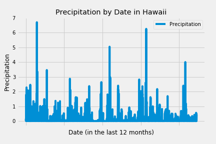
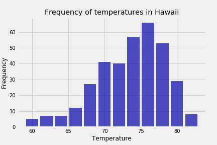

## Climate App using SQLAlchemy and Flask API

## Summary:
Python/Pandas/Matplotlib and SQLAlchemy ORM queries were used to conduct climate analysis and data explorations using a climate database.

-Precipitation data was queried for the last 12 months

-Total number of stations were queried and conditioned by the max and temperature analysis

-Queries were loaded into a pandas dataframe

-Visualiizations were created for each analysis

## Applications of the queries and initial analysis:

### Climate App
Developed a Flask API that utilized the previous analysis to return JSON lists of the data stored from the queries.

## Visualizations:

### Conclusion:
The code generated here is a quick and reliable way to retrieve data on weather conditions by specific location and date. For planning a trip to Hawaii, it appears that August temperatures mostly fall in the upper 70 degrees. This climate app would be applicable to any trip planning, and the days queried may be adjusted for the needs of the user.
