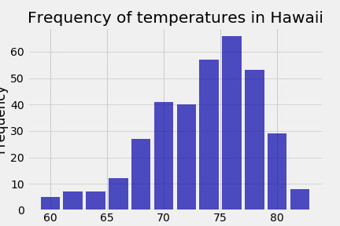

## Climate App using SQLAlchemy and Flask API

## Summary:
Python/Pandas/Matplotlib and SQLAlchemy ORM queries were used to conduct climate analysis and data explorations using a climate database. 
-Precipitation data was queried for the last 12 months
-Total number of stations were queried and conditioned by the max and temperature analysis
	-Queries were loaded into a pandas dataframe
	-Visualiizations were created for each analysis

## Applications of the queries and initial analysis:

### Climate App
Developed a Flask API that utilized the previous analysis to return JSON lists of the data stored from the queries.

## Visualizations:

